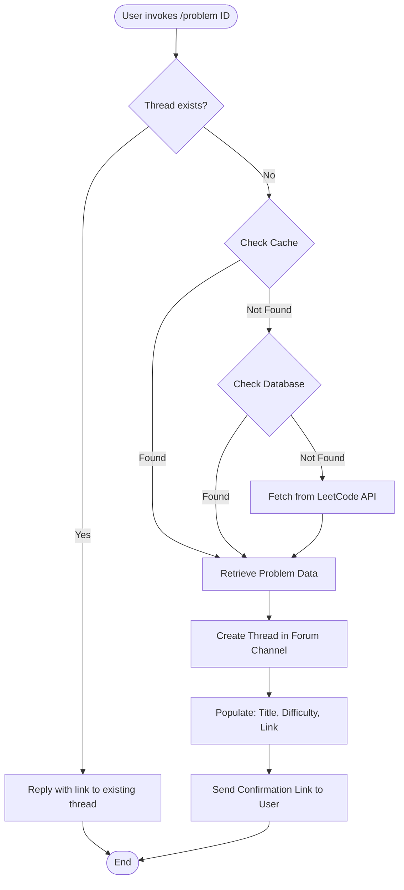
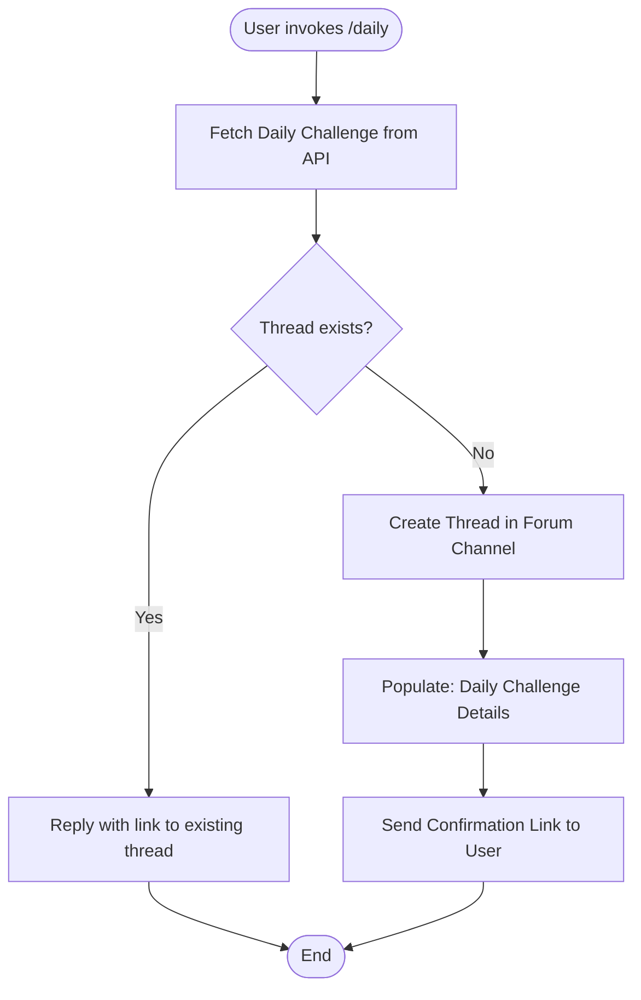

# Main Feature

<!--toc:start-->

- [Main Feature](#main-feature)
  - [LeetCode Commands](#leetcode-commands) - [LeetCode Problem Thread Creation](#leetcode-problem-thread-creation) - [Daily Challenge Thread Creation](#daily-challenge-thread-creation)
  <!--toc:end-->

## LeetCode Commands

For available commands, please refer to [README](../../README.md).

### LeetCode Problem Thread Creation

**`/problem <problem_id>`** Creates a thread for the specified LeetCode problem ID.

This command generates a dedicated discussion thread for the given problem, allowing users to collaborate and share solutions.

Logic Flow:

1. User invokes `/problem <problem_id>`.
2. The bot first checks if a thread for the problem already exists.
3. If not, it will get the problem first from cache, and then from database, and finally from LeetCode API if not found.
4. Once the problem data is retrieved, the bot creates a new thread in the designated channel configured for the server.
5. The bot populates the thread with the problem details, including title, difficulty, and a link to the problem on LeetCode.
6. The bot sends a confirmation message to the user with a link to the newly created thread.

Involved files/modules and functions:

- `cogs/leetcode.py`: Contains the command definition and logic for handling the `/problem` command.
  - `leetcode_problem` function: Handles the command invocation and orchestrates the thread creation process.
  - `_create_thread` function: Responsible for creating the thread and populating it with problem details.
  - `get_problem_desc_embed` function: Generates the embed message containing problem information.
- `core/leetcode_api.py`: Responsible for interacting with the [LeetCode API](https://github.com/noworneverev/leetcode-api/tree/main).
  - `fetch_problem_by_id` function: Fetches problem details using the provided problem ID.
  - `parse_single_problem_response` function: Parses the API response to extract relevant problem information.
- `db/problem.py`: Defines the `Problem` model used for database interactions.
- `db/problem_threads.py`: Defines the `ProblemThreads` model used to track created threads.
- `core/leetcode_problem.py`: Contains logic for managing LeetCode problems.
  - `get_problem` function: Retrieves problem details from cache, database, or API.
- `core/problem_threads.py`: Manages the creation and tracking of problem discussion threads.
  - `get_forum_channel` function: Determines the appropriate forum channel for thread creation.
  - `get_thread_by_problem_id` function: Checks if a thread for the problem already exists.
  - `delete_thread` function: Deletes a thread record from the database if the problem is found but the thread is missing in Discord.
- `utils/discord_utils`: Provides utility functions for Discord interactions.
  - `try_get_channel` function: Safely retrieves a Discord channel by ID.

Flow Diagram:

### Daily Challenge Thread Creation

This command is similar to the `/problem` command but specifically targets the daily challenge problem.

Since we have to fetch the daily challenge problem from LeetCode API directly, the logic flow is slightly different:

1. User invokes `/daily`.
2. The bot fetches the daily challenge problem _directly_ from LeetCode API.
3. The bot checks if a thread for the daily challenge already exists.
4. If not, it creates a new thread in the designated channel configured for the server.
5. The bot populates the thread with the daily challenge problem details.
6. The bot sends a confirmation message to the user with a link to the newly created thread.

Involved files/modules and functions:

- `cogs/leetcode.py`: Contains the command definition and logic for handling the `/daily` command.
  - `leetcode_problem` function: Handles the command invocation and orchestrates the thread creation process.
  - `_create_thread` function: Responsible for creating the thread and populating it with problem details.
  - `get_problem_desc_embed` function: Generates the embed message containing problem information.
- `core/leetcode_api.py`: Responsible for interacting with the [LeetCode API](https://github.com/noworneverev/leetcode-api/tree/main).
  - `get_daily_problem` function: Fetches the daily challenge problem details from the LeetCode API.
  - `parse_daily_problem_response` function: Parses the API response to extract relevant problem information.
- `db/problem.py`: Defines the `Problem` model used for database interactions.
- `db/problem_threads.py`: Defines the `ProblemThreads` model used to track created threads.
- `core/leetcode_problem.py`: Contains logic for managing LeetCode problems.
  - `get_problem` function: Retrieves problem details from cache, database, or API.
- `core/problem_threads.py`: Manages the creation and tracking of problem discussion threads.
  - `get_forum_channel` function: Determines the appropriate forum channel for thread creation.
  - `get_thread_by_problem_id` function: Checks if a thread for the problem already exists.
  - `delete_thread` function: Deletes a thread record from the database if the problem is found but the thread is missing in Discord.
- `utils/discord_utils`: Provides utility functions for Discord interactions.
  - `try_get_channel` function: Safely retrieves a Discord channel by ID.

Flow Diagram:

